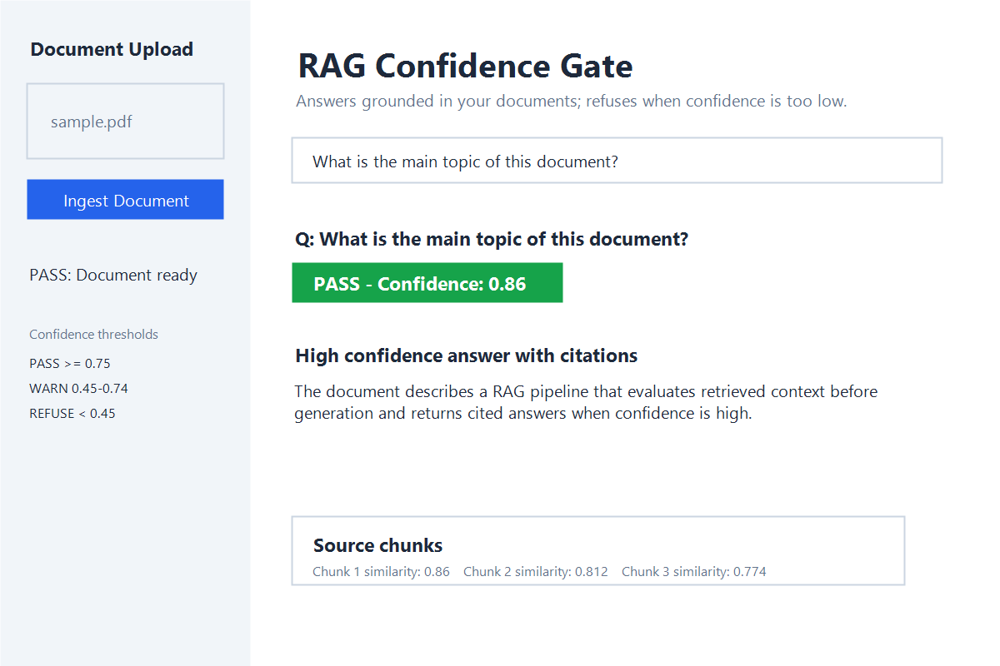
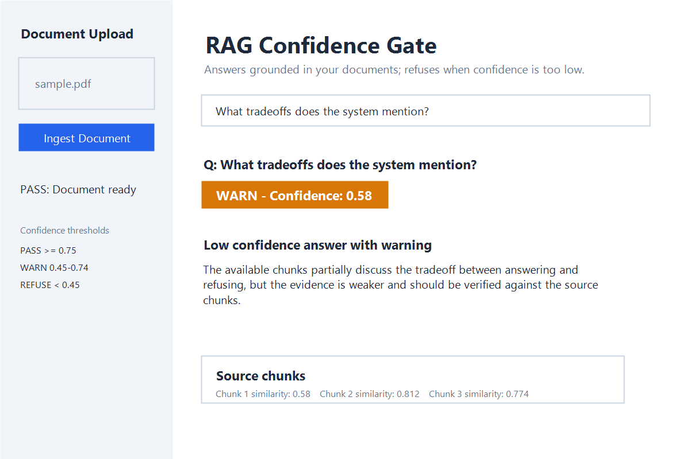
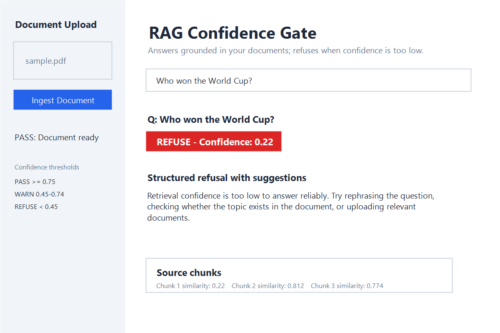

# rag-confidence-gate

A RAG pipeline that refuses to hallucinate.

## Live Demo

- Try it here: https://your-username-rag-confidence-gate.streamlit.app
- 2-minute demo video: https://youtube.com/your-link
- Deployment guide: [DEPLOYMENT.md](DEPLOYMENT.md)

## The Problem

Most RAG systems pass retrieval results to an LLM regardless of quality.
When context is poor, the model generates fluent but wrong answers.

## The Solution

A confidence gate scores retrieval quality before generation.
If the score is below threshold, the system refuses and explains why,
making hallucination structurally impossible.

## Screenshots

### PASS - High confidence answer with citations



### WARN - Low confidence answer with warning



### REFUSE - Structured refusal with suggestions



## Pipeline

Document -> Chunks -> Embeddings -> FAISS -> Retriever ->
Confidence Gate (PASS / WARN / REFUSE) -> LLM -> Structured JSON

## Stack

- sentence-transformers: local embeddings (all-MiniLM-L6-v2)
- FAISS: vector similarity search
- Ollama (mistral): local LLM inference, no API costs
- Claude API: production backend for Streamlit Cloud
- Streamlit: web UI
- pytest: gate unit tests

## Run Locally

```cmd
pip install -r requirements.txt
ollama pull mistral
streamlit run ui/app.py
```

To use Claude locally instead of Ollama, set `ANTHROPIC_API_KEY` in your environment.

## Confidence Thresholds

| Score     | Zone   | Behavior                          |
|-----------|--------|-----------------------------------|
| 0.75-1.00 | PASS   | Answer generated with citations   |
| 0.45-0.74 | WARN   | Answer generated, flagged         |
| 0.00-0.44 | REFUSE | No answer, structured refusal     |
